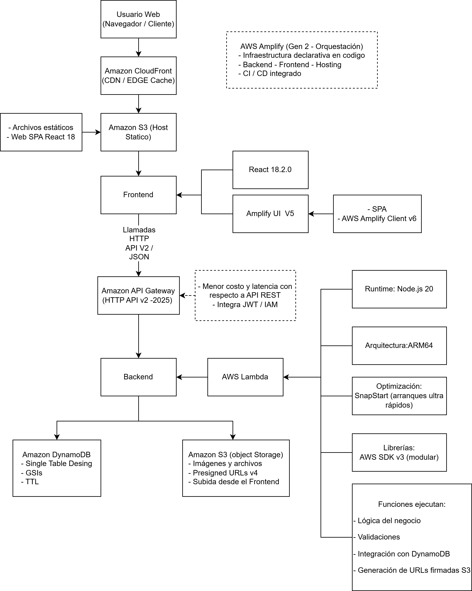

# 📘 Proyecto Cloud Native – Arquitectura Serverless (2025)

Este repositorio contiene una aplicación fullstack cloud-native diseñada con AWS Amplify (Gen 2), React 18, AWS Lambda, API Gateway HTTP API v2, DynamoDB y Amazon S3.

Incluye arquitectura moderna, escalable, segura y totalmente serverless.

---

# 🖼️ Arquitectura Completa (Versión Ampliada)




---

# 🧭 1. Descripción General del Proyecto

Este prototipo implementa una arquitectura moderna cloud-native con los siguientes componentes:

- **Frontend:** React 18 + Amplify UI v5  
- **Backend:** AWS Lambda (Node.js 20, ARM64, SnapStart)  
- **API:** Amazon API Gateway (HTTP API v2 – 2025)  
- **Base de Datos:** DynamoDB (single-table design, GSIs, TTL)  
- **Almacenamiento:** Amazon S3 (object storage + static hosting)  
- **Orquestación:** AWS Amplify Gen 2 (frontend, backend, hosting y CI/CD unificados)

---

# 🧱 2. Explicación de la Decisión del Prototipo

El objetivo es construir un prototipo moderno, escalable, de bajo costo y alineado con las arquitecturas serverless recomendadas en 2025.

### ✔ Beneficios clave:
- Escalabilidad automática real
- Operación sin servidores
- Latencia extremadamente baja
- Costos controlados
- Integración nativa de todos los módulos
- Alta disponibilidad

---

# 🎨 3. Frontend – React 18 + Amplify UI

### Tecnologías:
- React 18.2.0  
- Amplify UI v5  
- SPA servida desde S3 y CloudFront  
- AWS Amplify Client v6  

### Ejemplo de consumo de API:

```javascript
import { API } from "aws-amplify";

API.get("backendApi", "/items")
  .then(res => console.log(res))
  .catch(err => console.error(err));
```

---

# 🔧 4. Backend – AWS Lambda + API Gateway (HTTP API v2)

### Lambda configurado con:
- Node.js 20
- ARM64 (rendimiento + costo reducido)
- SnapStart (arranques ultra rápidos)
- AWS SDK v3 (modular)

### Ejemplo de Lambda:

```javascript
export const handler = async (event) => {
  if (event.routeKey === "GET /items") {
    return { statusCode: 200, body: "Listado de items" };
  }
};
```

---

# 🗄️ 5. Base de Datos – DynamoDB

### Diseño:
- Single-table design  
- GSIs  
- TTL  
- Integración directa desde Lambda  

### Ventajas:
- Escalabilidad masiva  
- Latencia < 10ms  
- Pago por uso  

---

# 📦 6. Almacenamiento de Objetos – Amazon S3

S3 se usa para:
- Archivos estáticos del frontend  
- Imágenes  
- Documentos  
- URLs firmadas v4 para privacidad

Ejemplo:

```javascript
import { Storage } from "aws-amplify";
await Storage.put("archivo.png", file);
```

---

# ☁️ 7. Selección del Proveedor Cloud – AWS

### Razones:
- Amplify Gen 2 (único en su tipo)
- S3 (estándar global)
- DynamoDB (líder en NoSQL)
- Lambda (mejor ecosistema serverless)
- CloudFront (CDN más rápido)
- Integración total frontend-backend

---

# 🧩 8. Cómo Usar el Proyecto

```bash
git clone <repo>
npm install
npm start
amplify init
amplify push
amplify publish
```

---

# 📁 9. Estructura del Proyecto

```
/src
/amplify
/public
package.json
README.md
```

---

# 🏁 10. Autor

**Edwin Ramos**  
Cloud • Fullstack • AI Developer  

---

# 📄 Licencia
MIT License
